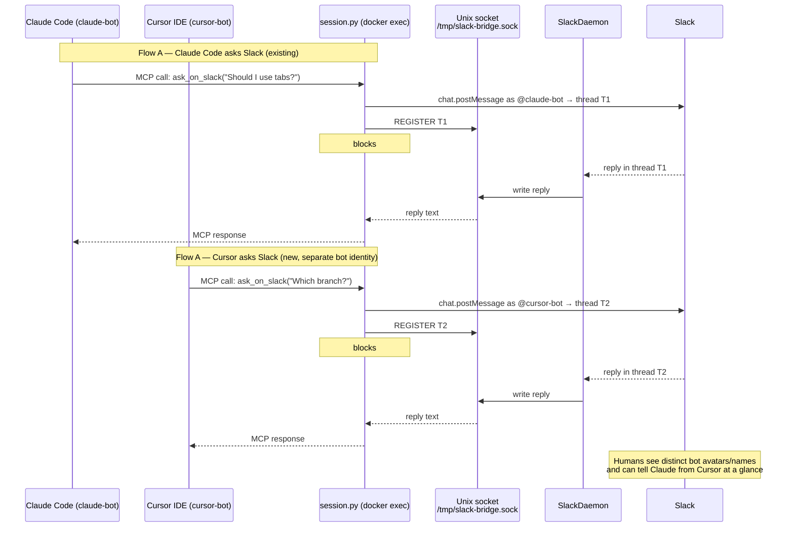

# Design: add-to-cursor — Connect Cursor IDE to the Claude-Slack-Bridge

## Goal & Scope

This feature enables Cursor IDE users to connect to the Claude-Slack-Bridge using the same MCP mechanism already used by Claude Code. A Cursor session can call `ask_on_slack` to post a message to a Slack channel and block until a human replies; the reply is returned to Cursor exactly as it would be returned to Claude Code.

**In scope:**
- Documentation for Cursor users explaining how to add the bridge as an MCP server (`.cursor/mcp.json` or the global `~/.cursor/mcp.json`)
- Two separate Slack bot identities: one for Claude Code sessions (`claude-bot`) and one for Cursor sessions (`cursor-bot`) — **required per reviewer feedback**
- Small code changes to `session.py` and `slack_daemon.py` to support selecting the correct bot credentials via a `CLIENT_ID` env var
- README update mentioning Cursor as a supported IDE

**Out of scope:**
- "Slack → Cursor" initiated sessions (Cursor has no spawnable CLI equivalent to `claude -p`, so the `SlackDaemon` Flow-B path is not extended to Cursor)
- Cursor extensions or Cursor-specific APIs
- Cursor CLI installation in the Dockerfile (not needed — Cursor runs on the developer's machine and calls into the bridge via `docker exec`)

The integration method is intentionally close to the Claude Code path — same `docker exec` transport, same `session.py` entry point, same env-var config model — with the addition of a `CLIENT_ID` selector to route each session through the correct Slack bot identity.

---

## System Diagram



**Two-bot architecture (reviewer requirement):** The system must operate with two separate Slack bot identities — one for Claude Code sessions and one for Cursor sessions. This means two Slack App credentials (bot tokens) and two corresponding `SLACK_BOT_TOKEN` / `SLACK_APP_TOKEN` pairs are configured in the container. The daemon and `session.py` must be able to route each session through the correct bot identity so that messages posted from a Cursor session appear under the Cursor bot's name and avatar in Slack, and messages from Claude Code sessions continue to appear under the Claude bot's name.

The Unix socket broker and daemon core remain unchanged; the identity-selection logic is the only new code concern (see File Changes below).

---

## Stack

| Component | Choice | Reason |
|---|---|---|
| MCP transport | stdio (via `docker exec -i`) | Cursor supports any stdio MCP server; matches the existing Claude Code setup exactly |
| Session process | `session.py` (FastMCP, Python) | Minimal change needed to pass bot-identity hint (see File Changes) |
| Config file | `.cursor/mcp.json` or `~/.cursor/mcp.json` | Cursor's documented MCP server config path |
| Bot credentials | Two Slack Apps (claude-bot + cursor-bot) | Reviewer requirement: each IDE client must appear as a distinct bot in Slack |
| Docs format | Markdown | Consistent with existing `docs/` |
| Cursor CLI | **Not required** | The integration uses `docker exec` as the MCP transport (same as Claude Code). Cursor CLI is a local IDE binary, not a server-side dependency — the Dockerfile does not need it. |
| Dockerfile | **Unchanged** | No new executables, runtimes, or system packages are added to the container. Bot tokens are passed as env vars at `docker run` / `docker exec` time, not baked into the image. |

> **Cursor CLI / Dockerfile clarification (reviewer feedback):** The Cursor CLI is not installed server-side. The bridge container does not need to launch or drive Cursor — it is Cursor running on the developer's machine that calls into the bridge over `docker exec`. The Dockerfile therefore requires no changes for this feature.

> **Two-bot credential model:** Two sets of Slack App credentials are needed (`CURSOR_SLACK_BOT_TOKEN` / `CURSOR_SLACK_APP_TOKEN` alongside the existing `SLACK_BOT_TOKEN` / `SLACK_APP_TOKEN`). These are injected as environment variables; no Dockerfile change is required.

---

## File Changes / File Structure

```
docs/
  cursor-setup.md          ← NEW: step-by-step Cursor MCP setup guide (two-bot credentials)
  mcp-client-setup.md      ← unchanged (Claude Code guide stays)
README.md                  ← MODIFIED: add Cursor to supported clients section
session.py                 ← MODIFIED: accept CLIENT_ID env var to select bot credentials
slack_daemon.py            ← MODIFIED: support loading cursor-bot token when CLIENT_ID=cursor
.env.example               ← MODIFIED: document CURSOR_SLACK_BOT_TOKEN / CURSOR_SLACK_APP_TOKEN
```

### `docs/cursor-setup.md` (new)

Mirrors `docs/mcp-client-setup.md` but adapted for Cursor:
- Config path: `.cursor/mcp.json` (project-level) or `~/.cursor/mcp.json` (global)
- `docker exec` command passes `CLIENT_ID=cursor` as an env var so the session selects the cursor-bot Slack credentials
- Cursor-specific verification steps (confirm the tool appears in Cursor's MCP panel)
- Note that Cursor does not need `.mcp.json` — it uses `.cursor/mcp.json` instead
- Documents both `CURSOR_SLACK_BOT_TOKEN` and `CURSOR_SLACK_APP_TOKEN` env vars that must be set in the container

### `README.md` (modified)

Add Cursor to the supported clients documentation, with a link to `docs/cursor-setup.md`.

### `session.py` (modified)

Read a `CLIENT_ID` environment variable (default: `"claude"`). When `CLIENT_ID=cursor`, look up `CURSOR_SLACK_BOT_TOKEN` / `CURSOR_SLACK_APP_TOKEN` instead of the default `SLACK_BOT_TOKEN` / `SLACK_APP_TOKEN`. Pass the resolved credentials to the Slack Web API client used to post messages. This is the only logic change needed to route each session through the correct bot identity.

### `slack_daemon.py` (modified)

The daemon already handles Socket Mode events for one Slack App. With two bots, a second Socket Mode client is started (one per App token). Each client independently forwards inbound replies to the Unix socket broker using the same existing protocol — the broker identifies which session to wake by thread timestamp, regardless of which bot was used to post. Alternatively, a single daemon can be refactored to hold two `AsyncWebClient` instances indexed by `CLIENT_ID` — the exact approach is deferred to the plan/implementation step.

### `.env.example` (modified)

Add `CURSOR_SLACK_BOT_TOKEN` and `CURSOR_SLACK_APP_TOKEN` placeholder entries with comments explaining the two-bot setup.

---

## Limitations

- **Slack → Cursor (Flow B) is not implemented.** Cursor has no CLI equivalent to `claude -p`, so the daemon cannot spawn a Cursor session in response to a top-level Slack message. This direction is deferred to a future feature (e.g., a Cursor extension or background-agent API).
- **MCP roots labelling may not work in Cursor.** The bridge uses `ctx.list_roots()` to derive a worktree label for visual identification in Slack. If Cursor does not send MCP roots, the label is silently omitted — sessions remain functional, just unlabelled.
- **Docker must be running on the same machine as Cursor.** The `docker exec` transport requires the bridge container to be reachable locally, same as for Claude Code.
- **Two Slack Apps must be created by the operator.** Each bot identity (Claude, Cursor) requires a separate Slack App registration with its own Bot Token and App-Level Token. This is a one-time setup step documented in `docs/cursor-setup.md`; no Dockerfile change is required since tokens are injected as env vars.
- **Open question:** Whether Cursor's MCP client sends the `roots` capability — needs verification against a live Cursor install. If not, the label feature is silently degraded (not broken).
- **Open question:** Whether the daemon runs one Socket Mode client per Slack App or one per process — the exact multi-bot daemon architecture is deferred to the plan/implementation step.
