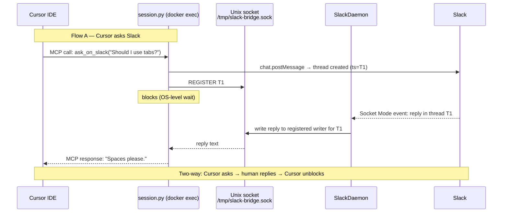

# Design: add-to-cursor — Connect Cursor IDE to the Claude-Slack-Bridge

## Goal & Scope

This feature enables Cursor IDE users to connect to the Claude-Slack-Bridge using the same MCP mechanism already used by Claude Code. A Cursor session can call `ask_on_slack` to post a message to a Slack channel and block until a human replies; the reply is returned to Cursor exactly as it would be returned to Claude Code.

**In scope:**
- Documentation for Cursor users explaining how to add the bridge as an MCP server (`.cursor/mcp.json` or the global `~/.cursor/mcp.json`)
- Verification that the existing `session.py` entry point works unchanged with Cursor's MCP client
- README update mentioning Cursor as a supported IDE

**Out of scope:**
- "Slack → Cursor" initiated sessions (Cursor has no spawnable CLI equivalent to `claude -p`, so the `SlackDaemon` Flow-B path is not extended to Cursor)
- Cursor extensions or Cursor-specific APIs
- Any changes to the daemon, session broker, or MCP server code (they already speak standard MCP)

Per user: integration method must be "same as Claude Code." Per user: two-way means Cursor sessions can ask Slack questions and receive replies (Flow A). The Slack-initiates-a-new-Cursor-session direction is deferred because Cursor exposes no CLI entry point for it.

---

## System Diagram



The daemon (`main.py` + `slack_daemon.py`) and the Unix socket broker are unchanged. Cursor uses the same `docker exec … python session.py` invocation that Claude Code uses; the MCP stdio transport is identical.

---

## Stack

| Component | Choice | Reason |
|---|---|---|
| MCP transport | stdio (via `docker exec -i`) | Cursor supports any stdio MCP server; matches the existing Claude Code setup exactly |
| Session process | `session.py` (FastMCP, Python) | Unchanged — already speaks standard MCP |
| Config file | `.cursor/mcp.json` or `~/.cursor/mcp.json` | Cursor's documented MCP server config path |
| Docs format | Markdown | Consistent with existing `docs/` |

No new libraries, services, or runtimes are introduced.

---

## File Changes / File Structure

```
docs/
  cursor-setup.md          ← NEW: step-by-step Cursor MCP setup guide
  mcp-client-setup.md      ← unchanged (Claude Code guide stays)
README.md                  ← MODIFIED: add Cursor to "Supported clients" section
```

### `docs/cursor-setup.md` (new)

Mirrors `docs/mcp-client-setup.md` but adapted for Cursor:
- Config path: `.cursor/mcp.json` (project) or `~/.cursor/mcp.json` (global)
- Same `docker exec … python session.py` command and env vars
- Cursor-specific verification steps (confirm the tool appears in Cursor's MCP panel)

### `README.md` (modified)

Add a "Supported clients" table or paragraph listing Claude Code and Cursor, with links to their respective setup docs.

No other files are modified.

---

## Limitations

- **Slack → Cursor (Flow B) is not implemented.** Cursor has no CLI equivalent to `claude -p`, so the daemon cannot spawn a Cursor session in response to a top-level Slack message. This direction is deferred to a future feature (e.g., a Cursor extension or background-agent API).
- **MCP roots labelling may not work in Cursor.** The bridge uses `ctx.list_roots()` to derive a worktree label for visual identification in Slack. If Cursor does not send MCP roots, the label is silently omitted — sessions are still functional, just unlabelled.
- **One Slack thread per Cursor session.** This matches the existing Claude Code behaviour; it is not specific to this feature.
- **Docker must be running on the same machine as Cursor.** The `docker exec` transport requires the bridge container to be reachable locally, same as for Claude Code.
