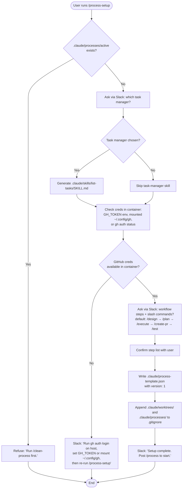
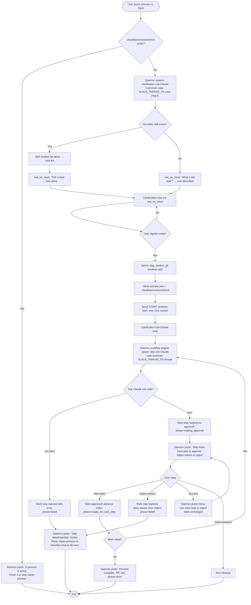
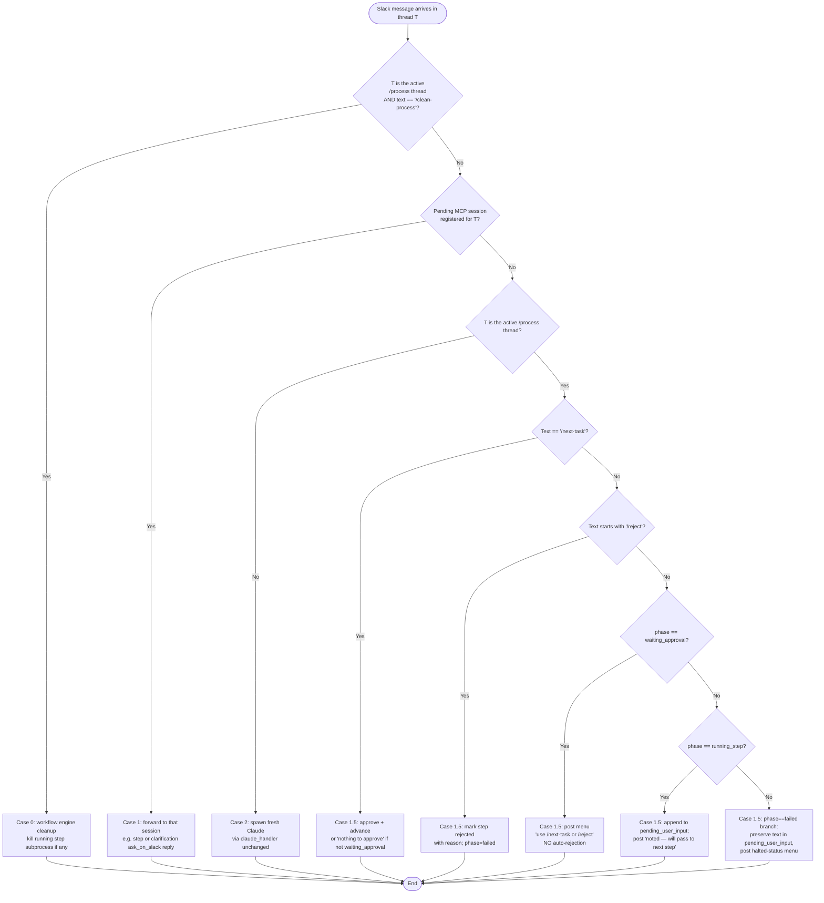

# Full-Process Plugin — Design

A Claude Code plugin that drives an entire feature-development workflow (clarify → design → plan → execute → PR → test) over Slack, using the existing `claude-slack-bridge` MCP server as the communication channel.

The plugin lives **inside this repo** under `/plugin`, runs **one feature at a time**, stores per-feature state **inside each git worktree**, keeps **all messages for one feature in one Slack thread**, and **stops on rejection** to wait for explicit instructions.

---

## 1. Goals

- The whole workflow for one feature happens in **one Slack thread**, even though each step runs in its own short-lived `claude -p` session.
- All human checkpoints (clarifications, approvals, rejections) happen in Slack via `ask_on_slack`. Both the clarification phase and any individual step can ask the user a question — every message lands in the same thread.
- Every workflow step is a real Claude Code slash command — no free-form prose execution.
- Each step runs in its own sub-Claude with `cwd` set to the worktree, so step skills can be written for a normal repo (no worktree-path gymnastics).
- State is a single JSON file per feature, lives in the worktree, deleted with `/clean-process`.
- **No Claude session orchestrates the workflow.** The Python daemon owns the state machine and the routing; Claude is invoked only when reasoning is required. The clarification sub-Claude is multi-turn and may run for several minutes; each step sub-Claude is short-lived (one slash command per spawn). Neither drives the loop — the daemon does.
- Workflow steps are defined once during setup and reused for every new feature in the repo.

---

## 2. Architecture

The work is split between **deterministic Python (the daemon)** and **reasoning Claude (sub-sessions)**. Routing, state mutation, subprocess spawning, and approval handling are pure state-machine work and live in the daemon. Anything that needs a model — the upfront clarification conversation and each step's actual execution — runs as a short-lived `claude -p`.

```
                                ┌───────────────────────────────────────┐
   Slack channel  ─── routes ──►│ slack_daemon (this repo)              │
   (per projects.json)          │  • Slack I/O                          │
                                │  • Thread router (Case 1.5)           │
                                │  • Workflow engine (state machine)    │
                                │  • Sub-Claude spawner                 │
                                └───────┬────────────────────┬──────────┘
                                        │ subprocess         │ subprocess
                                        ▼                    ▼
                ┌──────────────────────────────┐  ┌──────────────────────────────┐
                │ Clarification sub-Claude     │  │ Step sub-Claude (one per     │
                │ cwd = main repo              │  │ step, daemon spawns N of     │
                │ Skill: /process              │  │ these in sequence)           │
                │                              │  │ cwd = .claude/worktrees/<f>  │
                │ Drives clarify→slug→ack,     │  │ Cmd: /design / /plan / ...   │
                │ writes process.json,         │  │ May call ask_on_slack for    │
                │ exits.                       │  │ mid-step questions.          │
                └──────────────────────────────┘  └──────────────────────────────┘
```

**Daemon responsibilities** (new):

1. Detect that a top-level Slack message is `/process` and start the workflow.
2. Spawn the clarification sub-Claude, then on its exit, spawn step sub-Claudes one at a time per `process.json`.
3. Route incoming Slack messages on a `/process` thread (see §7) — to a registered MCP session, to the workflow engine as approval/rejection, or queue for the next step.
4. Mutate `process.json` (advance step, record rejection, queue user input).
5. Post templated approval prompts on step completion. Post step-failure messages on non-zero exit.
6. Hand the right `thread_ts` to every spawned sub-Claude so all `ask_on_slack` calls land in the same thread.

**Sub-Claude responsibilities** (slim):

- Clarification sub-Claude: have the upfront conversation, decide a slug, write `process.json`, exit. Optionally creates the worktree itself (or signals the daemon to do it — see §8).
- Step sub-Claudes: do the step's actual work. Optionally call `ask_on_slack` for mid-step clarifications. Exit with a one-line summary on success, non-zero on failure.

**Sub-Claudes do NOT** drive the loop, decide what step is next, mutate `process.json`'s top-level workflow state, or post approval prompts. That's the daemon.

This factoring sidesteps the original design's three pain points:

1. No Claude session has to listen on Slack while *also* spawning subprocesses — the daemon does both. The clarification session is allowed to be multi-turn because it's a single linear conversation, not a multiplexer.
2. The daemon's `cwd` doesn't matter — it spawns each sub-Claude with the right `cwd` for that phase (main repo for clarify, worktree for steps).
3. Existing/community slash commands (`/plan`, `/design`, etc.) still see `cwd = project root`, exactly as they expect.

---

## 3. Plugin Layout

```
plugin/
├── plugin.json                       # Plugin manifest (name, version, skills it ships)
├── skills/
│   ├── process-setup/                # One-time setup flow
│   │   └── SKILL.md
│   └── process/                      # Clarification phase + handoff to daemon
│       └── SKILL.md
└── templates/
    └── task-manager.md.tmpl          # Generated into .claude/skills/list-tasks/SKILL.md (optional)
```

The plugin **ships** two skills (`process-setup`, `process`) and **generates** an optional task-manager helper skill into the consumer repo at setup time.

The original design's `/next-task` and `/clean-process` slash commands are **gone** — they're now string-matched by the daemon directly when a user posts them in a `/process` thread (see §9). Removing them removes a layer of indirection and a generation step.

**Plugin↔daemon versioning.** The plugin and the daemon's workflow engine are version-locked: an old daemon paired with a newer plugin (or vice versa) will misinterpret state. `process-template.json` carries a `version` field; the daemon refuses to start a workflow if the template version is outside its supported range and posts a clear "upgrade the bridge" / "re-run /process-setup" message in Slack.

---

## 4. Files Written Into the Repo at Setup

| Path | Purpose | Owner |
|---|---|---|
| `.claude/process-template.json` | Ordered list of workflow steps for this repo | Setup (re-run setup to edit) |
| `.claude/skills/list-tasks/SKILL.md` | Optional sub-skill that fetches tasks from the user's task manager | Generated by setup if a task manager is detected |

Files written at runtime:

| Path | Purpose | Writer |
|---|---|---|
| `.claude/processes/active` | Marker file in the **main repo**: contains the path to the active worktree. Existence enforces single-active-process. | `/process` skill at end of clarification |
| `<worktree>/.claude/process.json` | Live state of the in-progress feature. | `/process` skill creates it; daemon mutates it as the workflow advances |
| `<worktree>/.claude/logs/<step>.log` | Stdout+stderr of each step sub-Claude. Promoted to v1 so step rejections are debuggable. | Daemon writes during step spawn |

Worktrees follow Claude convention: `.claude/worktrees/<feature>/` (sibling to `.claude/processes/`). Both are added to `.gitignore` by setup.

**Atomic creation of `.claude/processes/active`.** The marker is created with `O_CREAT | O_EXCL` (or rename-into-place from a tmp file). On `EEXIST`, the daemon treats it as "process already active" — guaranteeing single-active-process even under simultaneous `/process` posts. The in-memory `thread_ts → worktree` registry (§11.2) is a cache; the file is the source of truth.

**Worktree portability.** Git worktrees record absolute paths in `.git/worktrees/<f>/gitdir`. Worktrees in this design are created from inside the bridge container (path `/projects/<name>/.claude/worktrees/<f>`), so they should be treated as container-side artifacts: do not `cd` into them from the host. If a user wants to inspect the in-progress branch from their host editor, they should `git checkout` the branch directly, not open the worktree path.

---

## 5. process-template.json (repo-level)

Saved once by setup; copied into each worktree's `process.json` when a feature starts.

```json
{
  "version": 1,
  "branch_pattern": "feature/{slug}",
  "steps": [
    { "name": "design",     "command": "/design"     },
    { "name": "plan",       "command": "/plan"       },
    { "name": "execute",    "command": "/execute"    },
    { "name": "create-pr",  "command": "/create-pr"  },
    { "name": "test",       "command": "/test"       }
  ]
}
```

`command` is the slash command the daemon will instruct the step sub-Claude to run (the daemon's prompt says "run the slash command `<command>`"). Slash commands are the chosen mechanism because Claude Code recognises them by name in non-interactive `-p` mode, whereas raw skill names depend on the model deciding to invoke the Skill tool. If a step is implemented as a skill, ship a thin slash-command wrapper that delegates to the skill.

The user picks the steps, their order, and the slash-command name to invoke for each during `/process-setup`.

`version` is checked by the daemon on every spawn (see §3 — "Plugin↔daemon versioning"); if it falls outside the supported range, the daemon refuses to advance and posts a Slack message asking the user to re-run `/process-setup` or upgrade the bridge.

---

## 6. process.json (per-worktree, live state)

```json
{
  "feature": "user-channel-access-control",
  "branch": "feature/user-channel-access-control",
  "worktree": ".claude/worktrees/user-channel-access-control",
  "task_source": "linear:ENG-482",
  "task_description": "Restrict /next-task to authorized Slack users",

  "slack_channel": "C12345678",
  "slack_thread_ts": "1714124312.000200",

  "phase": "running_step",
  "current_step_index": 2,
  "current_step_pid": 48213,
  "pending_user_input": [],
  "pr_link": null,

  "steps": [
    { "name": "design",    "status": "approved",    "command": "/design",    "rejection_reason": null },
    { "name": "plan",      "status": "approved",    "command": "/plan",      "rejection_reason": null },
    { "name": "execute",   "status": "in progress", "command": "/execute",   "rejection_reason": null },
    { "name": "create-pr", "status": "not started", "command": "/create-pr", "rejection_reason": null },
    { "name": "test",      "status": "not started", "command": "/test",      "rejection_reason": null }
  ]
}
```

**phase** (top-level state machine cursor): `clarifying` | `ready_for_next_step` | `running_step` | `waiting_approval` | `done` | `failed`.

**Step status values**: `not started` | `in progress` | `waiting for approval` | `approved` | `rejected`.

**Phase handoff from clarification.** When the clarification skill finishes writing `process.json`, it sets `phase = "ready_for_next_step"` and leaves *every* step at `not started` (including step 0). The daemon flips `phase → "running_step"` and step 0 → `in progress` only after it has successfully spawned the sub-Claude. This way, a daemon crash between `START` and a successful spawn leaves the file in a recoverable, never-lying state.

**Mutation ownership.**
- The daemon owns: `phase`, `current_step_index`, `current_step_pid`, `pending_user_input`, `pr_link`, every `steps[].status`, every `steps[].rejection_reason`.
- Sub-Claudes do **not** write to `process.json`. They read it and they emit a one-line stdout summary; the daemon parses the summary and updates `process.json`.

**slack_thread_ts** is captured during clarification (the user's `/process` message ts becomes the thread root) and is the single source of truth for "where do all messages for this feature go." The daemon reads it before every sub-Claude spawn and injects it into the spawn's environment.

**pending_user_input** is a queue. If the user posts free text in the thread while a step is mid-run and not blocked on `ask_on_slack`, the daemon appends it here. At the *next* step spawn, the daemon (a) embeds the queued items as a section in the step prompt — "user posted the following while a previous step was running: …" — and (b) clears the queue itself. Sub-Claudes never touch the queue. (See §9.2 for routing details.)

**pr_link** is populated by the daemon when a step's stdout summary contains a line `PR_URL=<url>` (see §9.1). Sub-Claudes do not write this field directly.

**current_step_pid** lets the daemon (or `/clean-process`) kill the running step subprocess on demand.

---

## 7. Sub-Claude Invocation

For every sub-Claude (clarification or step), the daemon runs:

```
claude -p \
  --plugin-dir <plugin-path> \
  --mcp-config /app/mcp.in-container.json \
  --strict-mcp-config \
  --dangerously-skip-permissions \
  --output-format json \
  "<phase-specific prompt>"
```

with:
- `cwd = main repo` for the clarification sub-Claude,
- `cwd = <worktree-absolute-path>` for step sub-Claudes,
- `env["SLACK_THREAD_TS"] = process.json["slack_thread_ts"]`,
- `env["SLACK_CHANNEL"] = process.json["slack_channel"]`,
- `env["STEP_NAME"] = <step.name>` (only for step sub-Claudes — used by the broker to auto-prefix `[Step: <name>]` on every `ask_on_slack` message; see §11.1).

For the very first clarification spawn the daemon already knows the thread because the user's `/process` message `ts` is the thread root.

Notes:
- `--plugin-dir` — passes the same plugin into the sub-Claude so it can resolve `/design`, `/plan`, etc. (matches how the daemon already invokes Claude in [claude_handler.py:174-187](src/claude_handler.py#L174-L187)).
- `--mcp-config /app/mcp.in-container.json` + `--strict-mcp-config` — the existing project [.mcp.json](.mcp.json) launches the bridge MCP via `docker exec` because it's written for the user's *host* `claude` CLI. A sub-Claude spawned by the daemon already runs *inside* the bridge container, where `docker exec` is unreachable (the docker socket isn't mounted, see [docker-compose.yml:10-15](docker-compose.yml#L10-L15)). The daemon points sub-Claudes at a separate, container-local MCP config that launches the broker in-process — `python /app/src/session.py` over stdio — so `ask_on_slack` is reachable. `--strict-mcp-config` disables auto-discovery of the project `.mcp.json` to prevent accidentally hitting the broken `docker exec` path. The container-local config is generated at image build time and lives at `/app/mcp.in-container.json`.
- `--dangerously-skip-permissions` — required for non-interactive `-p` mode; matches the daemon's existing pattern.
- `--output-format json` — daemon parses the result event to detect success/failure. Reuses [`claude_handler._parse_response`](src/claude_handler.py#L233-L253) (handles both old and new event shapes); no second parser.
- `SLACK_THREAD_TS` / `SLACK_CHANNEL` / `STEP_NAME` — env vars are inherited by the in-process broker because the in-container MCP config launches it via plain stdio (no `docker exec` env-passthrough wall, unlike the host config). The daemon does NOT need to update [.mcp.json](.mcp.json) for this; the host-side config remains as-is for users who still want to chat with Claude on their machine against the same bridge.
- `SessionBroker` is extended to read `os.getenv("SLACK_THREAD_TS")` at startup and seed `_thread_ts` from it (see §11.1). Result: the sub-Claude's first `ask_on_slack` posts as a reply to the existing thread instead of opening a new one.

**Subprocess timeout** is wallclock and generous (default 60 minutes). It must accommodate the worst case of a step that itself does several `ask_on_slack` round-trips. There is no idle reset; the user can always invoke `/clean-process` if a step stalls. This is one knob, set per-deployment via env var (`PROCESS_STEP_TIMEOUT_MINUTES`); the existing `SUBPROCESS_TIMEOUT = 300` in [claude_handler.py:32](src/claude_handler.py#L32) is left untouched (it governs the unrelated Human→Claude path).

### 7.1 The step spawn prompt (framing)

The step prompt is templated and built by the daemon. It must do four things so that any community slash command (`/plan`, `/design`, etc.) — which has no native awareness of `/process` — behaves correctly inside the workflow:

1. **State the framing.** Tell the model it is running a specific named step of an active `/process`, so it can self-identify in any user-facing message.
2. **Point at the context file.** `process.json` lives in `cwd` and contains task description, prior step artifacts, slug, etc. The skill reads it *before* starting work.
3. **Constrain artifact location.** All outputs go inside the worktree (which is `cwd`). No writes to the main repo.
4. **Define the success contract.** A one-line stdout summary plus a non-zero exit code on failure (see "Stdout contract" below).

The template the daemon assembles for each step:

> You are running step **`<step.name>`** of an active `/process` workflow.
>
> **Context.** Read `.claude/process.json` first — it contains `task_description`, `slack_thread_ts`, prior step artifacts, and the feature slug. Do not modify it; the daemon owns it.
>
> **Pending user input.** While previous steps were running, the user posted the following messages (oldest first). Read them, factor them into your work, and call them out in your final summary if any change your behavior. The daemon has already cleared the queue — do not write back to it:
>
> ```
> <pending_user_input items, one per line, or "(none)" if empty>
> ```
>
> **Your job.** Run the slash command `<step.command>` for this feature. Save any artifacts you produce inside this worktree (your `cwd`).
>
> **If you need clarification from the user.** Call `ask_on_slack`. Your message will land in the existing Slack thread automatically, and the bridge will auto-prefix it with `[Step: <step.name>]` — you do not need to add the prefix yourself. Do not call `ask_on_slack` for things you can decide yourself.
>
> **Stdout contract.** On completion, print a single-line summary, then exit zero. The daemon parses the LAST line of your `result` for these optional `KEY=value` markers (one per line is fine):
> - `PR_URL=<url>` — recorded into `process.json.pr_link` (use this in the create-pr step).
> - Any other `KEY=value` is logged but ignored.
>
> On failure, exit non-zero with a one-line error message describing what went wrong. Do not exit zero on partial success.

`<step.name>` and `<step.command>` are substituted from `process.json["steps"][current_step_index]`. The clarification sub-Claude gets a similar but distinct template (no step name; framing is "you are running clarification for a new `/process`").

**Best-effort vs enforced.** Items 1–3 above are advisory — community slash commands may ignore them. The two things the daemon *enforces* without trusting the model:
- The `[Step: <name>]` prefix on every Slack message — implemented in the broker by reading `os.getenv("STEP_NAME")` and prepending it to the message in `SessionBroker.send_and_wait` before posting (§11.1). The model can't bypass it.
- Artifact location — the worktree IS `cwd`, and `--add-dir` is intentionally NOT passed (see §7), so writes outside cwd require the model to use absolute paths, which `--dangerously-skip-permissions` will allow but step logs will catch.

The daemon captures stdout, writes it to `<worktree>/.claude/logs/<step>.log`, parses the result, and:
- On clean exit → marks the step `waiting for approval`, scrapes any `KEY=value` markers from the result line (e.g. `PR_URL=`), posts the approval prompt to Slack.
- On non-zero exit / parse failure → marks the step `rejected`, copies the last 1KB of the log file into `rejection_reason`, posts a Slack message that includes the log path, halts. (Distinguishing "Claude crashed" from "step exited 1 deliberately" is best-effort: a crash typically yields garbage stdout / no `result` event; the daemon notes "exit code N, parser found no result event" in that case.)

---

## 8. The Two Plugin Skills

### 8.1 `/process-setup` — one-time per-repo configuration

Triggered by the user once, after installing the plugin. Runs in a normal Claude session (the daemon spawns it like any other Slack-driven Claude conversation; the user invokes the skill from there).

**Refuse-during-active.** If `.claude/processes/active` exists, setup refuses with "A feature is in progress. Run `/clean-process` first or wait for it to finish before re-configuring." This prevents template drift mid-run.

Responsibilities:
1. Detect a task manager. Ask via `ask_on_slack` which one (Linear / Jira / GitHub Issues / Notion / none). If chosen, generate `.claude/skills/list-tasks/SKILL.md` with concrete instructions for hitting that system's CLI/API.
2. Verify GitHub credentials are available **inside the bridge container**:
   - The bridge image bakes in the `gh` CLI (Dockerfile addition).
   - Auth is done host-side, not in the container. Setup checks for credentials in this order: (a) `GH_TOKEN` env var, (b) a mounted `~/.config/gh/` (read-only), (c) `gh auth status` succeeds.
   - If none are present, setup posts: "GitHub auth missing. On your host machine run `gh auth login`, then either set `GH_TOKEN=$(gh auth token)` in your `.env` for the bridge or mount `~/.config/gh` into the container (see README). Re-run `/process-setup` once that's done." It does NOT try to launch a browser-based OAuth flow inside the container.
3. Ask the user for their AI workflow steps. Default suggestion: `design → plan → execute → create-pr → test`. User can add, remove, reorder, and pick the slash command name to invoke per step (default: same as step name with `/` prefix).
4. Write `.claude/process-template.json` with the chosen steps and `version: 1`.
5. Append `.claude/worktrees/` and `.claude/processes/` to `.gitignore` if missing.
6. Confirm in Slack: "Setup complete. Post `/process` in this channel to start a feature."

### 8.2 `/process` — clarification + handoff

Triggered by the user posting `/process` (or `@bot /process`) as a top-level message in a project channel. The daemon's message handler recognises the literal `/process` and:

1. **Refuses if a process is already active.** The daemon attempts `O_CREAT | O_EXCL` on `.claude/processes/active.lock` (a tmp lock file written before the real marker). On `EEXIST` OR if `.claude/processes/active` already exists, the daemon posts "A process is active — finish it or post `/clean-process`." in a reply, returns. This atomic check defeats the race between two simultaneous `/process` posts.
2. Otherwise spawns the **clarification sub-Claude**: `cwd = main repo`, `env["SLACK_THREAD_TS"] = <ts of the user's /process message>`, `env["SLACK_CHANNEL"] = <channel id>`, prompt = "Run the `/process` clarification skill."

The `/process` skill itself (running inside that sub-Claude) does the reasoning work:

1. **Acquire the task** — if `list-tasks` skill exists, invoke it (in-session, via Skill tool — task listing doesn't need the worktree) and ask the user via Slack to pick one; otherwise ask "what is the task?".
2. **Clarification loop** — ask follow-up questions via `ask_on_slack` until the user signals ready. (All these messages land in the existing thread because `SLACK_THREAD_TS` was injected.)
3. **Derive a feature slug** from the task title; confirm with the user.
4. **Create the worktree**: `git worktree add .claude/worktrees/<feature> -b feature/<feature>`.
5. **Materialize state** — copy `.claude/process-template.json` → `<worktree>/.claude/process.json`, fill in feature/branch/task fields, set `slack_channel` and `slack_thread_ts`. Set `phase = "ready_for_next_step"`, leave every `steps[].status = "not started"` (including step 0), `current_step_index = 0`, `current_step_pid = null`. **The skill does NOT mark step 0 `in progress`** — the daemon does that only after a successful spawn (see §6 "Phase handoff from clarification").
6. **Write `.claude/processes/active`** in the main repo (atomic rename from a tmp file), containing the worktree path.
7. **Notify the daemon**: send a one-line message over the Unix socket — `START <worktree-path>\n` (a new verb alongside the existing `REGISTER`). The daemon's workflow engine picks it up and begins the step loop.
8. **Exit** with a short success summary.

From step 7 onward, **no Claude session is needed for this feature until the daemon spawns the next step**. The daemon drives everything until completion or `/clean-process`.

---

## 9. Daemon-Side Workflow Engine

Replaces the original `/next-task` and `/clean-process` Claude slash commands. The daemon recognises them as literal text in any active `/process` thread and handles them in Python.

### 9.1 Step loop (driven by the workflow engine)

Triggered by `START <worktree>` from `/process`, and again on every state transition (step approval, user reply, etc.).

```
loop:
  load process.json
  check version is supported; if not, post upgrade message and return
  if phase in ("done", "failed", "clarifying"): return
  if phase == "running_step":
    # Already running — do nothing, the subprocess-exit handler will fire next.
    return
  if phase == "waiting_approval":
    # Waiting for /next-task or /reject — do nothing.
    return
  # phase == "ready_for_next_step" (set by clarification or by the approval handler)
  step = steps[current_step_index]

  # Drain the queue into the prompt, clear it before spawn.
  queued_input = process.json.pending_user_input.copy()
  process.json.pending_user_input = []
  prompt = render_step_prompt(step, queued_input)   # see §7.1 template

  step.status = "in progress"
  phase = "running_step"
  save process.json

  log_path = "<worktree>/.claude/logs/<step.name>.log"
  spawn sub-Claude (
    cwd=worktree,
    env={SLACK_THREAD_TS, SLACK_CHANNEL, STEP_NAME=step.name},
    prompt=prompt,
    stdout/stderr → log_path,
    timeout=PROCESS_STEP_TIMEOUT_MINUTES,
  )
  record current_step_pid

  attach exit handler:
    on clean exit:
      result = parse_response(stdout)         # reuse claude_handler._parse_response
      markers = scrape_kv_lines(result)       # e.g. PR_URL=...
      if "PR_URL" in markers: process.json.pr_link = markers["PR_URL"]
      step.status = "waiting for approval"
      phase = "waiting_approval"
      current_step_pid = null
      post "Step <name> done. Reply /next-task to approve, or /reject <reason> to reject."
      append result summary to that post.
    on non-zero exit / timeout / parse failure:
      step.status = "rejected"
      step.rejection_reason = (last 1KB of log_path) + " (exit=N)"
      phase = "failed"
      current_step_pid = null
      post "Step <name> failed. See <log_path>. Reply /clean-process or describe what to do next."
```

### 9.2 Slack message router (revised precedence)

The router needs to handle one new wrinkle: a step sub-Claude can be blocked on `ask_on_slack` (registered in `_pending`), and a user reply during that window should normally go to the step — **except** for emergency-stop control commands that must always reach the workflow engine. So `/clean-process` is lifted to **Case 0** (before the existing Case 1 pending-session forward); `/next-task` and `/reject` stay in Case 1.5 (after Case 1, since they're nonsensical mid-step anyway).

Revised order in `_handle_slack_message`:

```
text_stripped = text.strip() if thread_ts else ""
process_thread = thread_ts and thread_ts is the active /process thread

# Case 0 (NEW): emergency-stop control commands always reach the workflow engine,
# even if a step sub-Claude is currently blocked on ask_on_slack. Without this,
# Case 1 would forward "/clean-process" into the step as if it were a clarification answer.
if process_thread and text_stripped == "/clean-process":
  run cleanup (see §9.3)
  return

# Case 1 (UNCHANGED): pending MCP session registered for this thread → forward.
# Catches mid-step ask_on_slack replies and clarification-phase replies.
if thread_ts and pending session exists:
  forward to session, return

# Case 1.5 (NEW): thread belongs to active /process, no pending session.
if process_thread:
  if text_stripped == "/next-task":
    if phase == "waiting_approval":
      mark current step approved
      advance current_step_index
      if more steps: phase = "ready_for_next_step"; trigger step loop
      else:          phase = "done"; post final message with PR link
    else:
      post "Nothing to approve right now."
    return

  if text_stripped.startswith("/reject"):
    if phase == "waiting_approval":
      reason = text_stripped[len("/reject"):].strip() or "(no reason given)"
      mark current step rejected; rejection_reason = reason
      phase = "failed"
      post "Step <name> rejected: <reason>. Halted. Reply /clean-process or describe what to do next."
    else:
      post "Nothing to reject right now."
    return

  if phase == "waiting_approval":
    # Free text after step completion: do NOT auto-reject. The user might
    # be asking a clarifying question before deciding. Echo the menu back
    # and let them be explicit.
    post "Use `/next-task` to approve, `/reject <reason>` to reject. \
          Free-text discussion is not yet routed during approval (will be in v2). \
          The step output is still in this thread above."
    return

  if phase == "running_step":
    # Mid-step user message — the running sub-Claude is NOT blocked on ask_on_slack
    # (otherwise Case 1 would have caught it). Queue it for the next step.
    process.json.pending_user_input.append(text)
    save
    post "Noted — will pass to the next step (it'll see this in its prompt). \
          If you need it acted on now, wait for the current step to ask, or `/clean-process`."
    return

  if phase == "failed":
    # User chatting after a halt; not auto-routed. Tell them their options.
    post "This process has halted. Reply `/clean-process` to wipe it, \
          or describe what you want next and I'll surface it on cleanup."
    process.json.pending_user_input.append(text)   # preserve for post-mortem
    return
```

**Why no automatic free-text rejection.** A user typing "what did the design step pick for X?" should not nuke the workflow. v1 makes the user opt into rejection explicitly with `/reject`. A v2 enhancement (deferred, §12) can route free text in `waiting_approval` to a sidebar Claude conversation that doesn't change workflow state.

### 9.3 `/clean-process` (daemon-handled)

1. Read `.claude/processes/active` to find the active worktree.
2. If `current_step_pid` is set and the process is alive, kill it. (This will also break any pending `ask_on_slack` — the Unix socket closes, the broker raises, the subprocess exits.)
3. Remove the `thread_ts → worktree` entry from the in-memory active-process registry.
4. `git worktree remove --force <worktree>` (and optionally `git branch -D <branch>` after a Slack confirmation). The worktree's `process.json` and `logs/` go with it.
5. Delete `.claude/processes/active` and any leftover `.claude/processes/active.lock`.
6. Post "Cleaned up. Ready for the next `/process`."

---

## 10. Activity Diagrams

### 10.1 Setup flow



### 10.2 Full process flow (daemon engine + sub-Claudes)



### 10.3 Mid-step user message routing (updated precedence)



---

## 11. Integration With the Existing Bridge

The MCP tool surface, the project [.mcp.json](.mcp.json), and the Human→Claude path are unchanged. Everything else (broker env-handling, daemon command routing, Dockerfile, in-container MCP config) is touched but in narrowly-scoped ways listed below.

### 11.1 `SessionBroker` reads `SLACK_THREAD_TS` and `STEP_NAME` from env

In [session_broker.py:31-34](src/session_broker.py#L31-L34), seed `_thread_ts` and `_step_name` from env vars at construction, and prefix outgoing messages when a step name is set:

```python
def __init__(self, post_message: PostMessageFn, timeout_minutes: int = 5) -> None:
    self._post_message = post_message
    self._timeout = timeout_minutes * 60.0
    self._thread_ts: str | None = os.getenv("SLACK_THREAD_TS") or None
    self._step_name: str | None = os.getenv("STEP_NAME") or None

async def send_and_wait(self, message: str) -> str:
    # Auto-prefix when running inside a /process step. The model can't bypass
    # this — it's enforced in the broker, not requested in the prompt.
    if self._step_name and not message.startswith(f"[Step: {self._step_name}]"):
        message = f"[Step: {self._step_name}] {message}"
    # ... existing logic ...
```

Effect:
- Existing flows (env vars unset): broker behaves exactly as today — first `ask_on_slack` opens a new thread, no prefix.
- `/process` clarification: `SLACK_THREAD_TS` set, `STEP_NAME` unset → all messages thread together, no prefix.
- `/process` step: both set → all messages thread together AND every message is `[Step: <name>] …`.

This is the **only behavioral change in the broker** required for `/process`. `--strict-mcp-config` (see §7) ensures sub-Claudes never accidentally hit the host-side `.mcp.json`.

### 11.2 Daemon: `/process` command detection + workflow engine + router

New responsibilities in `slack_daemon.py` and surrounding code:

1. **Top-level `/process` recognition** in `_handle_slack_message` — when the user posts `/process` (top-level, optionally @bot prefixed), spawn the clarification sub-Claude instead of falling through to the generic `claude_handler` path.
2. **Unix-socket `START` verb** in `_handle_session_connection` (currently only `REGISTER` is supported, [slack_daemon.py:182](src/slack_daemon.py#L182)) — accepts `START <worktree-path>\n` from the clarification skill and hands the worktree path to the workflow engine.
3. **Workflow engine module** (new file, `src/workflow.py`) — the state machine described in §9.1. Owns spawning step sub-Claudes, attaching exit handlers, mutating `process.json`, posting approval prompts. Reuses [`claude_handler._parse_response`](src/claude_handler.py#L233-L253) for stdout parsing — does not duplicate it.
4. **Case 1.5 router** in `_handle_slack_message` — described in §9.2. Inserted between the existing Case 1 and Case 2.
5. **Active-process registry** — the daemon maintains an in-memory map `thread_ts → (worktree_path, channel_id)` for fast Case 1.5 lookup, populated on `START` and cleared on `done`/`failed`/`/clean-process`. Backed by `.claude/processes/active` so it survives restart. The file is the source of truth; the map is a cache.
6. **Hoist channel→project resolver.** Today the channel→project mapping lives only in [`ClaudeHandler._channel_id_to_project`](src/claude_handler.py#L65). The workflow engine needs the same lookup (to find the main repo from the Slack channel of a `/process` post). Extract the loader/resolver from `claude_handler.py` into a small shared module (e.g. `src/projects.py`) consumed by both `ClaudeHandler` and the workflow engine. Same `projects.json` schema, same `plugin_dir` handling — no config changes.
7. **In-container MCP config.** Generate `/app/mcp.in-container.json` at image build time (or on daemon startup) with the broker launched as `python /app/src/session.py` over stdio, no `docker exec`. The Dockerfile copies/writes this file. The host-side project [.mcp.json](.mcp.json) is left unchanged for users running `claude` on their own machine.
8. **Atomic active-marker write.** Use `O_CREAT | O_EXCL` on a tmp lockfile, then `os.replace()` to publish `.claude/processes/active`. Both the daemon (during `/process` admission check) and the clarification skill (during the actual write) follow the same protocol.
9. **Bake `gh` into the image.** Add `gh` to the `apt-get install` line in [Dockerfile:4-11](Dockerfile#L4-L11) so the setup skill can invoke it. Compose-side: document `GH_TOKEN` in `.env.example` and a read-only mount of `~/.config/gh`.

### 11.3 What stays unchanged

- The MCP server / `ask_on_slack` tool surface — same signature, same return type. Only the broker's internal handling of `_thread_ts` and the new `[Step: …]` prefix change (§11.1).
- The Unix socket protocol's `REGISTER` verb and reply-forwarding flow ([slack_daemon.py:174-203](src/slack_daemon.py#L174-L203)). `START` is added alongside, not in place of.
- `claude_handler.py`'s Human→Claude path — left untouched aside from the channel→project resolver hoist (§11.2 #6, mechanical refactor that preserves behavior). Threads not tracked as active `/process` threads behave exactly as today.
- `projects.json` schema — no worktree entries needed; the daemon resolves `cwd` per spawn from `process.json`. (Channel mapping format is unchanged.)
- The host-side project [.mcp.json](.mcp.json) — unchanged. Users running `claude` on their own host against the bridge keep their existing config. Only the new `/app/mcp.in-container.json` is added, used exclusively by sub-Claudes spawned inside the bridge container.

---

## 12. Open Questions / Deferred

- **Multi-feature parallelism** is explicitly out of scope (v1 is single active process). The `.claude/processes/active` marker is the chokepoint; lifting it later would require keying state by Slack thread or feature name and turning the active-process registry into a multi-entry map. The marker file would become `.claude/processes/<feature>` and `active` would be replaced by an index.
- **Rejection recovery UX** — v1 halts on rejection. A future iteration could add `/retry-step` and `/skip-step` (also daemon-string-matched, no Claude needed).
- **Daemon crash recovery** — on restart, the daemon scans every project's `.claude/processes/active` and the referenced `process.json` to rebuild its in-memory registry. If `phase == "running_step"` with a no-longer-alive `current_step_pid`, mark the step `failed` with rejection_reason `"daemon restarted while step was running — pid <N> gone"` and post a notice. v1 requires manual `/clean-process` to recover. Sessions blocked on `ask_on_slack` at restart will see their Unix sockets close and the broker will raise `RuntimeError`; the running step then exits non-zero and the daemon's exit handler fires the same path.
- **Sub-Claude timeout** — wallclock, env-tunable (`PROCESS_STEP_TIMEOUT_MINUTES`, default 60). On timeout, daemon kills the subprocess and treats it as a normal non-zero exit. Idle-based reset is deferred — needs broker→daemon heartbeat plumbing.
- **Branch name override** — `branch_pattern` in the template defaults to `feature/{slug}`; user can override per-template. v2 may extend with `{ticket}` or `{date}`.
- **Free-text routing in `waiting_approval`** — v1 echoes a menu and refuses to mutate state. v2 should route free text in this phase to a sidebar Claude (Case-2-style spawn) that can answer questions about the step output without touching workflow state, then prompt again for `/next-task` or `/reject`.
- **Generic vs `/process`-specific Slack listening** — Case 1.5 only intercepts threads in the active-process registry. Free-form Slack chat with the bot in any other thread is unaffected.
- **Plugin↔daemon version drift recovery** — daemon refuses to advance with a clear error when `process-template.json.version` is out of range, but does not auto-migrate. v2 may add a migration step.
- **In-container `gh` authorization for org-protected repos** — `GH_TOKEN` works for personal repos and PATs scoped to orgs; SAML-protected orgs require token re-authorization that's a manual host step. Document but don't try to automate.

### Resolved (lifted out of "deferred" into v1)

- Step execution logs at `<worktree>/.claude/logs/<step>.log` — promoted to v1 (§4, §7.1, §9.1) because rejection messages are unactionable without them.
- Pending-user-input delivery — v1 injects queued items into the next step's prompt and clears the queue (§7.1, §9.1). Sub-Claudes never touch the queue.
- PR-link extraction — v1 contract: step stdout summary may include `PR_URL=<url>`, daemon scrapes and writes to `process.json.pr_link` (§7.1, §9.1).
